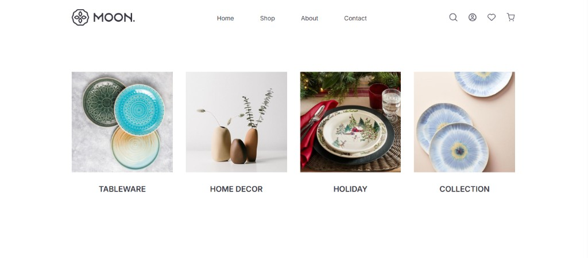

# Moon

A static **home décor / ceramics** storefront-style landing page: header navigation, category tiles, and a **Best Sellers** product grid. Built with plain HTML and CSS—no framework or build step.

## Preview



## What’s in the page

1. **Header** — Logo, nav links (Home, Shop, About, Contact), and icon row (search, account, wishlist, cart). Mobile menu button is styled for smaller breakpoints.
2. **Collections** — Four category cards (e.g. tableware, home décor, holiday).
3. **Best Sellers** — Product cards with image, title, price, short description, and **Add to cart** buttons (UI only).

## Tech stack

- HTML5
- CSS (`main.css` for development; `main.min.css` is also linked)
- [Google Fonts](https://fonts.google.com/) — Inter and EB Garamond

## Run locally

**Option A — Open the file**

Double-click `index.html` or open it from your editor’s preview.

**Option B — Local server** (avoids some browser restrictions on `file://`)

```bash
# Python 3
python -m http.server 8080
```

Then visit `http://localhost:8080`.

## Project layout

```
Moon/
├── index.html      # Page markup
├── main.css        # Styles
├── main.min.css    # Minified styles (linked alongside main.css)
├── images/         # SVGs, product and category images
└── README.md
```

## Notes

- This is a **front-end demo**: links and cart actions are not wired to a backend.
- Add or replace assets under `images/` to match your `index.html` paths.
